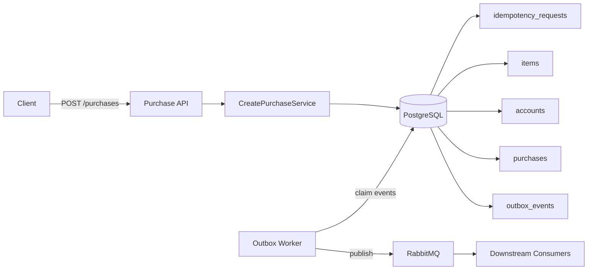
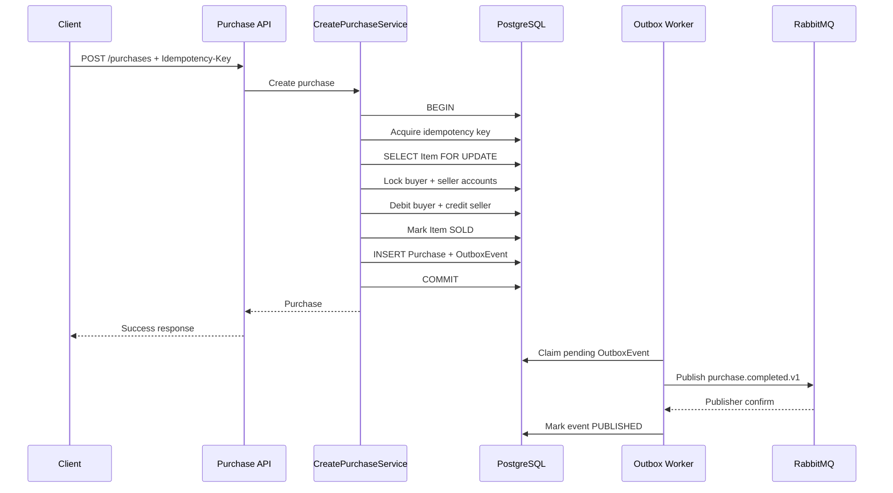
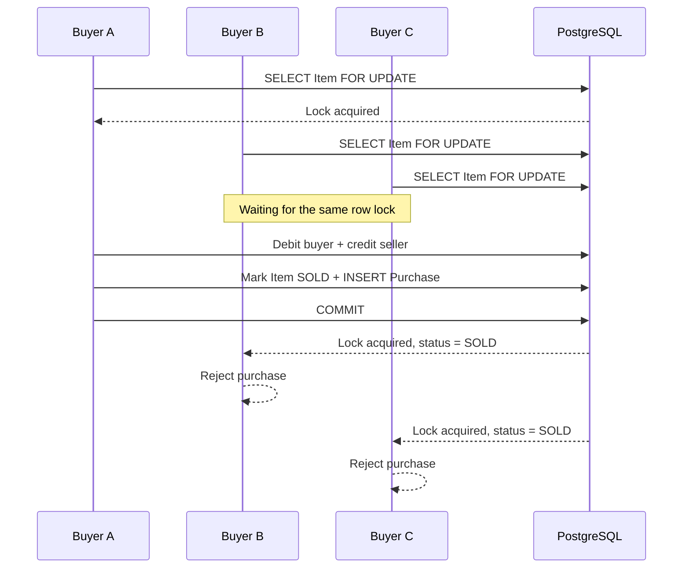
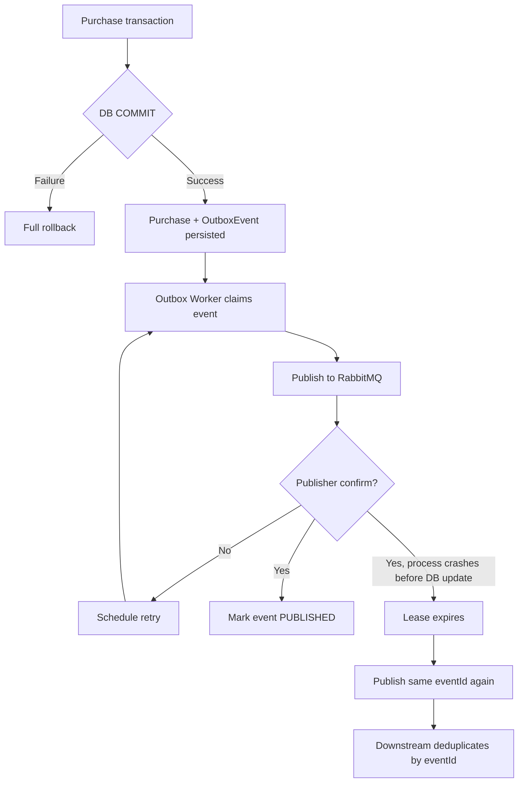

# Marketplace Purchases Service

NestJS сервис для безопасной покупки товара на маркетплейсе.

Сервис решает три основные задачи: защищает товар от двойной продажи при конкурентных запросах, обеспечивает идемпотентность HTTP операции и надежно доставляет событие о покупке через Transactional Outbox.

**Stack:** NestJS, TypeScript, TypeORM, PostgreSQL, RabbitMQ, Testcontainers, Docker Compose.

## Быстрый запуск

Создайте `.env` на основе `.env.example`, затем запустите:

```bash
docker compose up --build
```

Compose поднимает `app`, `postgres` и `rabbitmq`. Миграции выполняются автоматически. Demo данные создаются только при их отсутствии.

API доступен на `http://localhost:3000`.

RabbitMQ Management UI доступен на `http://localhost:15672`.

### Demo request

```http
POST /purchases
Idempotency-Key: demo-purchase-001
Content-Type: application/json
```

```json
{
  "buyerId": "00000000-0000-4000-8000-000000000002",
  "itemId": "00000000-0000-4000-8000-000000000003",
  "expectedItemVersion": 1
}
```

PowerShell:

```powershell
$body = @{
  buyerId = "00000000-0000-4000-8000-000000000002"
  itemId = "00000000-0000-4000-8000-000000000003"
  expectedItemVersion = 1
} | ConvertTo-Json

Invoke-RestMethod `
  -Method Post `
  -Uri "http://localhost:3000/purchases" `
  -Headers @{ "Idempotency-Key" = "demo-purchase-001" } `
  -ContentType "application/json" `
  -Body $body
```

Повтор того же запроса с тем же `Idempotency-Key` вернет ту же Purchase без повторного списания денег.

Для полного сброса demo состояния:

```bash
docker compose down -v
docker compose up --build
```

## Что реализовано

| Область | Решение |
| --- | --- |
| Purchase API | `POST /purchases` |
| Validation | Zod для body и `Idempotency-Key` |
| Concurrency | PostgreSQL `SELECT ... FOR UPDATE` |
| Balance consistency | Row locks, conditional debit, DB constraint |
| Idempotency | `idempotency_requests` + request hash |
| Event delivery | Transactional Outbox |
| RabbitMQ | Durable topic exchange, persistent messages, publisher confirms |
| Retry | Exponential backoff + jitter |
| Outbox scaling | `FOR UPDATE SKIP LOCKED` + lease |
| Tests | PostgreSQL и RabbitMQ Testcontainers |
| Local environment | Docker Compose |

## Business invariants

- Один Item может иметь не более одной успешной Purchase.
- Баланс buyer не может стать отрицательным.
- Изменение балансов, Item, создание Purchase и OutboxEvent выполняются атомарно.
- Один `Idempotency-Key` с одним payload соответствует одной Purchase.

## Архитектура



Correctness lives in PostgreSQL. Изменение балансов, Item, Purchase, IdempotencyRequest и OutboxEvent выполняется в одной транзакции. RabbitMQ не вызывается внутри purchase transaction.

### Purchase transaction

```text
BEGIN

1. Acquire Idempotency-Key
2. Validate request hash on retry
3. Lock Item FOR UPDATE
4. Validate status and version
5. Read seller and price from Item
6. Lock buyer and seller accounts in deterministic order
7. Validate buyer balance
8. Debit buyer
9. Credit seller
10. Mark Item as SOLD and increment version
11. Create Purchase
12. Create OutboxEvent
13. Link IdempotencyRequest to Purchase

COMMIT
```



Используется `READ COMMITTED`. Корректность обеспечивают явные row locks, unique constraints, conditional updates и одна атомарная транзакция. Повышение isolation level до `SERIALIZABLE` здесь не требуется.

## Конкурентная покупка

Item блокируется через `SELECT ... FOR UPDATE`. Только одна transaction может изменить конкретный Item в момент времени. После первой успешной покупки Item становится `SOLD`, остальные запросы получают конфликт.

БД дополнительно защищает инвариант через `UNIQUE(purchases.item_id)`. Даже ошибка в application code не должна позволить создать две Purchase для одного Item.

Buyer и seller accounts блокируются в одинаковом порядке по `id`. Это снижает вероятность deadlock при встречных денежных операциях.



## Деньги

Для балансов и цены используется `NUMERIC(20,2)` и `BigNumber`. JavaScript `number` не участвует в денежных расчетах.

Списание выполняется условным запросом с проверкой `balance >= amount`. На уровне схемы действует `CHECK (balance >= 0)`.

Purchase хранит собственный snapshot цены. Изменение Item после покупки не меняет исторические данные Purchase.

## Idempotency

Idempotency хранится отдельно в `idempotency_requests`.

Уникальность задается по `(buyer_id, key)`. Для операции сохраняется `request_hash`.

| Запрос | Результат |
| --- | --- |
| Новый key | Выполняется purchase flow |
| Тот же key и тот же payload | Возвращается исходная Purchase |
| Тот же key и другой payload | `409 IDEMPOTENCY_KEY_REUSED` |
| Повтор после потерянного HTTP response | Возвращается уже committed Purchase |

Idempotency захватывается до обработки Item. Это защищает обычные retry и несколько одинаковых запросов, пришедших одновременно.

## Item version

Клиент передает `expectedItemVersion`. Цена и sellerId никогда не считаются доверенными данными клиента и читаются из Item после получения lock.

Если Item изменился после того, как клиент его увидел, сервис возвращает `ITEM_CHANGED`. После успешной покупки версия Item увеличивается.

## Transactional Outbox и RabbitMQ

Purchase и OutboxEvent создаются в одной PostgreSQL транзакции. Это исключает состояние, когда Purchase committed, а намерение отправить событие потеряно.

Outbox worker забирает готовые события через `FOR UPDATE SKIP LOCKED`, записывает `locked_by` и `locked_until`, завершает короткую DB transaction и только после этого выполняет network call в RabbitMQ.

После publisher confirm событие получает статус `PUBLISHED`. При ошибке сохраняются `attempts`, `last_error` и `next_attempt_at`. Retry выполняется с exponential backoff и jitter. После лимита попыток событие остается в БД со статусом `FAILED`.



### Delivery semantics

Доставка событий имеет семантику `at-least-once`.

Если RabbitMQ подтвердил публикацию, а процесс завершился до обновления OutboxEvent, событие может быть отправлено повторно. `eventId` стабилен и равен `OutboxEvent.id`. Downstream consumer должен выполнять deduplication по `eventId`.

Publisher confirm подтверждает прием сообщения брокером. Он не является consumer ACK и не дает end-to-end exactly-once guarantee.

### Event contract

```json
{
  "eventId": "uuid",
  "eventType": "purchase.completed.v1",
  "occurredAt": "2026-08-20T15:00:00.000Z",
  "aggregateType": "purchase",
  "aggregateId": "purchase-uuid",
  "payload": {
    "purchaseId": "uuid",
    "itemId": "uuid",
    "buyerId": "uuid",
    "sellerId": "uuid",
    "amount": "150.00"
  }
}
```

Event contract не зависит от TypeORM entities.

## Поведение при сбоях

| Сценарий | Результат |
| --- | --- |
| Ошибка до commit | PostgreSQL rollback |
| Недостаточно средств | Purchase не создается |
| Item уже продан | Purchase не создается |
| Ошибка внутри purchase transaction | Все локальные изменения rollback |
| HTTP response потерян после commit | Retry возвращает исходную Purchase |
| RabbitMQ временно недоступен | Purchase остается committed, событие остается надежно сохранено в Outbox и будет повторно обработано |
| Publish завершился ошибкой | Событие планируется на retry |
| Worker умер после claim | Lease истекает, событие может забрать другой worker |
| RabbitMQ принял event, Outbox не обновился | Возможна повторная доставка с тем же `eventId` |

## Тесты

Тесты используют реальные PostgreSQL и RabbitMQ через Testcontainers.

Проверены успешная атомарная покупка, изменение балансов, переход Item в `SOLD`, создание Purchase и OutboxEvent.

Проверена гонка из 50 разных покупателей за один Item. Создается ровно одна Purchase, списание и начисление происходят один раз.

Проверены 50 конкурентных retry с одним `Idempotency-Key`. Все запросы получают одну и ту же Purchase.

Проверен сценарий, где один buyer одновременно покупает два разных Item, а баланса хватает только на один. Успешна только одна Purchase. Второй запрос получает `INSUFFICIENT_FUNDS`. Buyer списывается один раз, seller получает деньги только за одну покупку, создаются одна Purchase и один OutboxEvent.

Проверено повторное использование key с другим payload.

Проверены RabbitMQ publish, stable `messageId`, publisher confirm, retry после ошибки и работа нескольких Outbox workers.

Запуск:

```bash
npm run test
```

Проверка типов и lint:

```bash
npm run check
```

## Основные trade-offs

| Решение | Почему выбрано | Trade-off |
| --- | --- | --- |
| PostgreSQL lock вместо Redis lock | PostgreSQL является source of truth и защищает business invariant | Hot Item создает row contention |
| `SELECT ... FOR UPDATE` | Явная модель concurrency и стабильный Item snapshot для проверок | Atomic conditional `UPDATE ... RETURNING` потребовал бы меньше round trips |
| Обычное ожидание lock | Сохраняет простую семантику purchase request | При сильном contention можно рассмотреть `NOWAIT` или короткий `lock_timeout` |
| `READ COMMITTED` | Явные locks и DB constraints уже обеспечивают correctness | Требует осознанной работы с locking |
| Transactional Outbox | Purchase и event intent сохраняются атомарно | Delivery остается `at-least-once` |
| Одна PostgreSQL database | Все текущие invariants можно закрыть одной ACID транзакцией | При разделении ownership понадобится Saga и distributed workflow |
| Mutable `accounts.balance` | Достаточно для scope задания | Для financial-grade audit лучше immutable ledger |

## Production considerations

Redis можно использовать для load shedding или уменьшения contention, но не как единственный механизм защиты Item.

Для очень горячих Item можно добавить короткий `lock_timeout` или `NOWAIT`, чтобы не занимать connection pool большим количеством ожидающих запросов.

Пока Accounts, Items и Purchases находятся в одной PostgreSQL database и участвуют в общей строгой бизнес-инварианте, локальная ACID transaction проще и сильнее Saga. Если ownership разделится между сервисами и БД, потребуется Saga с reservations, compensation, Outbox и idempotent consumers.

Для marketplace с асинхронной передачей товара модель может эволюционировать через reservations: `Item: AVAILABLE → RESERVED → FULFILLING → SOLD`, при неуспешном fulfillment `RESERVED → AVAILABLE / CANCELLED`; деньги: `AVAILABLE → HELD → CAPTURED`, при failure `HELD → RELEASED`. Текущая реализация намеренно следует упрощенным требованиям тестового, где после покупки деньги сразу списываются buyer и начисляются seller.

Для системы с повышенными требованиями к финансовому аудиту `accounts.balance` можно заменить или дополнить immutable ledger для audit и reconciliation. Это production evolution, а не требование текущего тестового.

## Допущения

Authentication не входит в scope задания, поэтому `buyerId` передается в request body. В production он должен определяться по authenticated principal.

Самостоятельная покупка собственного Item запрещена.

Используется одна валюта с двумя знаками после запятой. Полная currency model находится вне scope задания.
